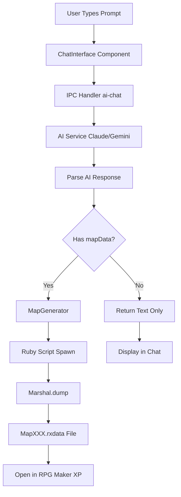
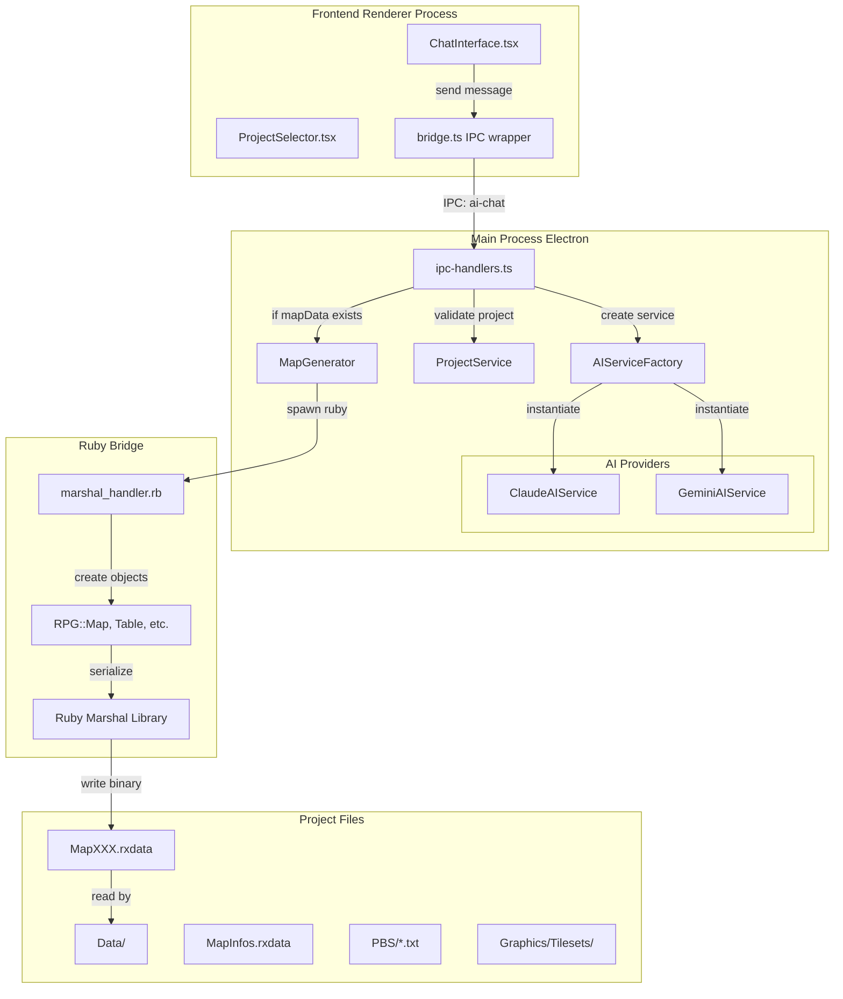
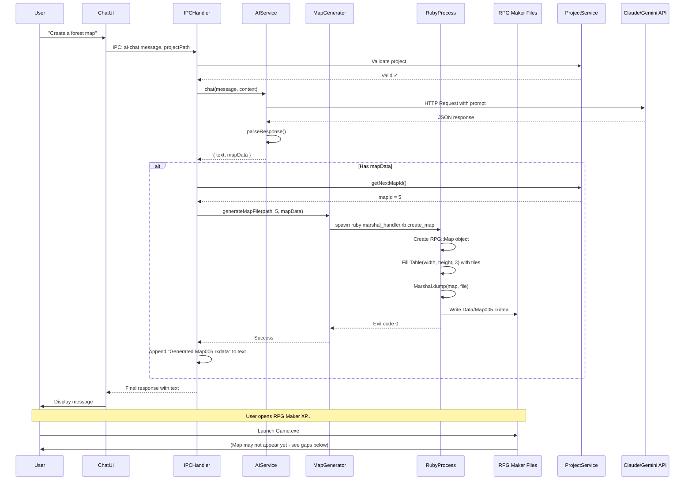

# Pokemon Game Builder - Complete Architecture & Flow

## Current System Overview

The Pokemon Game Builder uses AI to automate RPG Maker XP game development. Here's how it works:

### 1. High-Level Flow



### 2. Detailed Component Architecture



### 3. AI Response Format

**Current Expected Output:**

```typescript
interface ChatResponse {
  text: string;           // Friendly message to user
  mapData?: MapData;      // Optional map generation data
}

interface MapData {
  id: number;             // Auto-assigned by system
  name: string;           // e.g., "Viridian Forest"
  width: number;          // Minimum 20
  height: number;         // Minimum 15
  tilesetId: number;      // Default 1
  layers: number[][][];   // [3 layers][y][x] tile IDs
  events: any[];          // NPCs, items, etc.
}
```

**Example AI Output (Map Creation):**

```json
{
  "text": "I've created a peaceful forest map with a small pond!",
  "mapData": {
    "name": "Peaceful Forest",
    "width": 25,
    "height": 20,
    "tilesetId": 1,
    "layers": [
      [[384, 384, 384, ...], [384, 385, 384, ...], ...],  // Ground layer
      [[0, 0, 48, ...], [0, 48, 48, ...], ...],          // Middle layer (trees)
      [[0, 0, 0, ...], [0, 0, 0, ...], ...]              // Top layer (decorations)
    ],
    "events": []
  }
}
```

### 4. Data Flow: Prompt → Playable Game



### 5. Key Files and Their Roles

| File | Purpose | Current Status |

|------|---------|---------------|

| [`src/renderer/components/ChatInterface.tsx`](src/renderer/components/ChatInterface.tsx) | User input UI, message display | ✅ Complete |

| [`src/main/ipc-handlers.ts`](src/main/ipc-handlers.ts) | Routes requests between frontend/AI/files | ✅ Complete |

| [`src/main/ai-service-claude.ts`](src/main/ai-service-claude.ts) | Claude API integration, response parsing | ⚠️ Partial - needs better prompt engineering |

| [`src/main/map-generator.ts`](src/main/map-generator.ts) | Spawns Ruby to create .rxdata files | ⚠️ Partial - missing MapInfos registration |

| [`src/bridge/marshal_handler.rb`](src/bridge/marshal_handler.rb) | Serializes Ruby objects to Marshal format | ✅ Complete for basic maps |

| [`src/main/project-service.ts`](src/main/project-service.ts) | Project validation, next ID lookup | ⚠️ Partial - needs MapInfos reading |

### 6. Critical Gaps (Why Maps Don't Appear in RPG Maker XP)

**Gap 1: MapInfos.rxdata Registration**

- **Problem:** Created maps are not registered in `MapInfos.rxdata`
- **Impact:** RPG Maker XP doesn't know the map exists
- **Solution Needed:** 
  - Read existing `MapInfos.rxdata` using Ruby Marshal
  - Add new entry with map ID, name, parent_id
  - Write back to file
- **Location:** `src/main/map-generator.ts` line 56-59 (TODO comment)

**Gap 2: AI Tile Generation Quality**

- **Problem:** AI doesn't understand tileset IDs or proper tile placement
- **Impact:** Maps may be blank or have incorrect graphics
- **Current:** AI returns placeholder `[[0,0,0,...]]` or random numbers
- **Solution Needed:**
  - Provide AI with tileset documentation in system prompt
  - Include visual examples of tile IDs (grass=384, water=392, etc.)
  - Add validation/fallback for invalid tile IDs
- **Location:** [`src/main/ai-service-claude.ts`](src/main/ai-service-claude.ts) line 24-44 (system prompt)

**Gap 3: No Visual Preview**

- **Problem:** User must open RPG Maker XP to see results
- **Impact:** Slow feedback loop, poor UX
- **Solution Needed:**
  - Add `MapPreview.tsx` component with canvas rendering
  - Load tileset PNG files
  - Render tile layers on HTML canvas
  - Display before/after file write
- **Location:** New component needed

**Gap 4: No Asset Management**

- **Problem:** No way to select/manage tilesets, character graphics
- **Impact:** All maps use default tileset #1
- **Solution Needed:**
  - Read `Tilesets.rxdata` to list available tilesets
  - Allow user to specify which tileset to use
  - Preview tileset graphics before map creation
- **Location:** New service needed

**Gap 5: Limited to Maps Only**

- **Problem:** Can only create maps, not Pokemon, trainers, items, events
- **Impact:** Not a complete game builder yet
- **Solution Needed:**
  - Add PBS file generators (pokemon.txt, trainers.txt, etc.)
  - Event script generation for NPCs, battles, items
  - Multi-step workflows (e.g., "Create gym leader with team")
- **Location:** New services needed

### 7. How User Sees Changes in RPG Maker XP (Current vs. Ideal)

**Current Process (Broken):**

1. User creates map in Pokemon Game Builder
2. Map file `MapXXX.rxdata` is written to `Data/` folder
3. User opens RPG Maker XP
4. **Map doesn't appear** in map list (MapInfos not updated)
5. User must manually create map in RPG Maker XP, then replace file

**Ideal Process (After Fixes):**

1. User creates map in Pokemon Game Builder
2. App writes both `MapXXX.rxdata` AND updates `MapInfos.rxdata`
3. App shows live preview of the map in the chat interface
4. User opens RPG Maker XP
5. **Map appears** in the map tree with correct name
6. User double-clicks map to edit or playtest immediately

### 8. Technical Requirements for Complete Flow

**For Maps to Work:**

- ✅ Ruby installed and in PATH (completed in previous session)
- ✅ Marshal serialization working ([`marshal_handler.rb`](src/bridge/marshal_handler.rb))
- ❌ MapInfos.rxdata read/write capability (MISSING)
- ❌ Proper AI understanding of tileset structure (WEAK)
- ❌ Visual preview system (MISSING)

**For Complete Game Building:**

- ❌ PBS file generation (pokemon.txt, trainers.txt, abilities.txt, etc.)
- ❌ Event system (NPCs, dialogues, item pickups)
- ❌ Script.rxdata manipulation (for custom features)
- ❌ Audio/Graphics asset import

### 9. Tile ID System Explained

RPG Maker XP uses a tileset PNG (usually 256x8192px) where:

- Each tile is 32x32 pixels
- Tile IDs are sequential from top-left (0) to bottom-right
- Tileset #1 typically has:
  - 0-383: Base terrain (grass, dirt, sand)
  - 384-400: Grass variants
  - 401-420: Water tiles
  - 421+: Cliffs, rocks, trees

**Example Tile Mapping:**

```
Tile ID 384 = Grass (top-left of grass section)
Tile ID 392 = Water (top-left of water section)
Tile ID 48 = Tree (middle layer)
```

The AI must output these numeric IDs in the `layers` array for the Ruby script to write correctly.

## Summary

**What Works:**

- User can type prompts
- AI responds with structured JSON
- Ruby bridge creates valid .rxdata files
- Files are written to correct location

**What's Missing:**

- MapInfos registration (maps invisible in RPG Maker XP)
- AI tile knowledge (maps are blank/incorrect)
- Visual feedback (no preview)
- Full game building features (only maps supported)

**Next Steps to Make It Functional:**

1. Implement MapInfos.rxdata read/write
2. Enhance AI prompt with tileset documentation
3. Add visual map preview component
4. Expand to PBS files and events