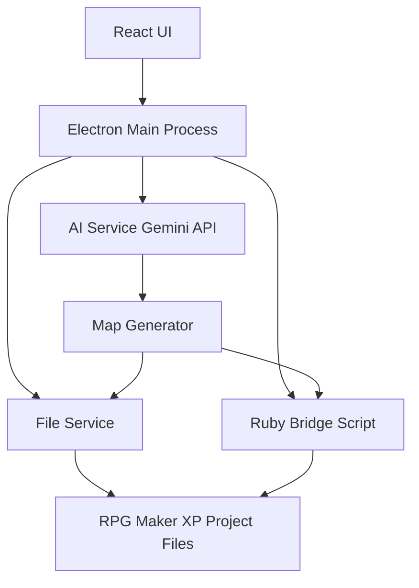

# Pokemon Game Builder - POC Implementation Plan

## Architecture Overview

The application will be a companion desktop app built with Electron + TypeScript + React that communicates with RPG Maker XP/Pokemon Essentials projects through file system operations. Since RPG Maker XP uses Ruby Marshal format (.rxdata files), we'll use a hybrid approach: Node.js for file operations and a Ruby bridge script for complex Marshal operations.



## Technology Stack Justification

**Electron + TypeScript + React:**

- Cross-platform desktop app
- Familiar stack for the developer
- Good file system access via Node.js
- Modern UI capabilities

**Ruby Bridge Script:**

- RPG Maker XP uses Ruby Marshal format (.rxdata files)
- Node.js doesn't have native Marshal support
- Ruby script will handle Marshal serialization/deserialization
- Called via child_process from Electron

**File-based Communication:**

- Direct file manipulation of RPG Maker XP project structure
- No need for complex IPC initially
- Pokemon Essentials projects are file-based

## Project Structure

```
pokemon-game-builder/
├── src/
│   ├── main/                    # Electron main process
│   │   ├── main.ts              # Entry point
│   │   ├── window.ts            # Window management
│   │   └── ipc-handlers.ts      # IPC handlers
│   ├── renderer/                # React frontend
│   │   ├── components/
│   │   │   ├── ChatInterface.tsx
│   │   │   ├── ProjectSelector.tsx
│   │   │   └── MapPreview.tsx
│   │   ├── services/
│   │   │   ├── ai-service.ts    # Gemini API client
│   │   │   └── project-service.ts
│   │   └── App.tsx
│   ├── shared/                  # Shared types/utilities
│   │   └── types.ts
│   └── bridge/                  # Ruby bridge scripts
│       └── marshal_handler.rb
├── package.json
├── tsconfig.json
└── README.md
```

## Key Components

### 1. AI Service (`src/renderer/services/ai-service.ts`)

- Gemini API integration
- Chat interface handler
- Map generation prompts
- Response parsing

### 2. Project Service (`src/renderer/services/project-service.ts`)

- Pokemon Essentials project detection
- Project file structure management
- Map file operations

### 3. Ruby Bridge (`src/bridge/marshal_handler.rb`)

- Read/write .rxdata files (Ruby Marshal format)
- Map data structure manipulation
- Event creation
- Called via `child_process.spawn` from Electron

### 4. Map Generator (`src/main/map-generator.ts`)

- Orchestrates AI + file operations
- Converts AI output to RPG Maker XP map format
- Handles tilesets, events, connections

## Implementation Details

### RPG Maker XP Map Structure

- Maps stored in `Data/MapXXX.rxdata` files
- Each map contains: tiles, events, metadata
- Map connections defined in map data
- Tilesets referenced from `Data/Tilesets.rxdata`

### AI Integration Flow

1. User sends message via chat interface
2. AI Service formats prompt with context (current project, available tilesets)
3. Gemini API generates map specification (JSON format)
4. Map Generator converts JSON to RPG Maker XP format
5. Ruby bridge script writes .rxdata file
6. Changes reflected when RPG Maker XP project is opened

### POC Features (MVP)

- Chat interface with Gemini API
- Project path selection (existing or new)
- Map creation: Generate a simple map with:
  - Basic tileset
  - Player starting position
  - Map connections
  - Simple events (NPCs, items)
- Map preview (basic visualization)

## File Format Handling Strategy

Since .rxdata files are Ruby Marshal format:

1. **Ruby Bridge Script**: Handle Marshal serialization
2. **JSON Intermediate Format**: AI generates JSON, we convert to Marshal
3. **Template System**: Use existing map templates as base

## Dependencies

- `electron`: Desktop app framework
- `react` + `react-dom`: UI framework
- `@google/generative-ai`: Gemini API client
- `fs-extra`: Enhanced file operations
- Ruby (system dependency for bridge script)

## Setup Instructions

1. Install Node.js 18+
2. Install Ruby 2.7+ (for bridge script)
3. Run `npm install`
4. Configure Gemini API key in settings
5. Select Pokemon Essentials project path

## Limitations & Future Enhancements

**POC Limitations:**

- Basic map generation only
- Simple event types
- Manual tileset selection
- No real-time preview in RPG Maker XP

**Future Enhancements:**

- Real-time sync with RPG Maker XP
- Advanced event scripting
- Asset generation (sprites, tilesets)
- Script generation
- Multi-map world building